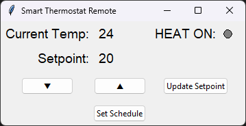
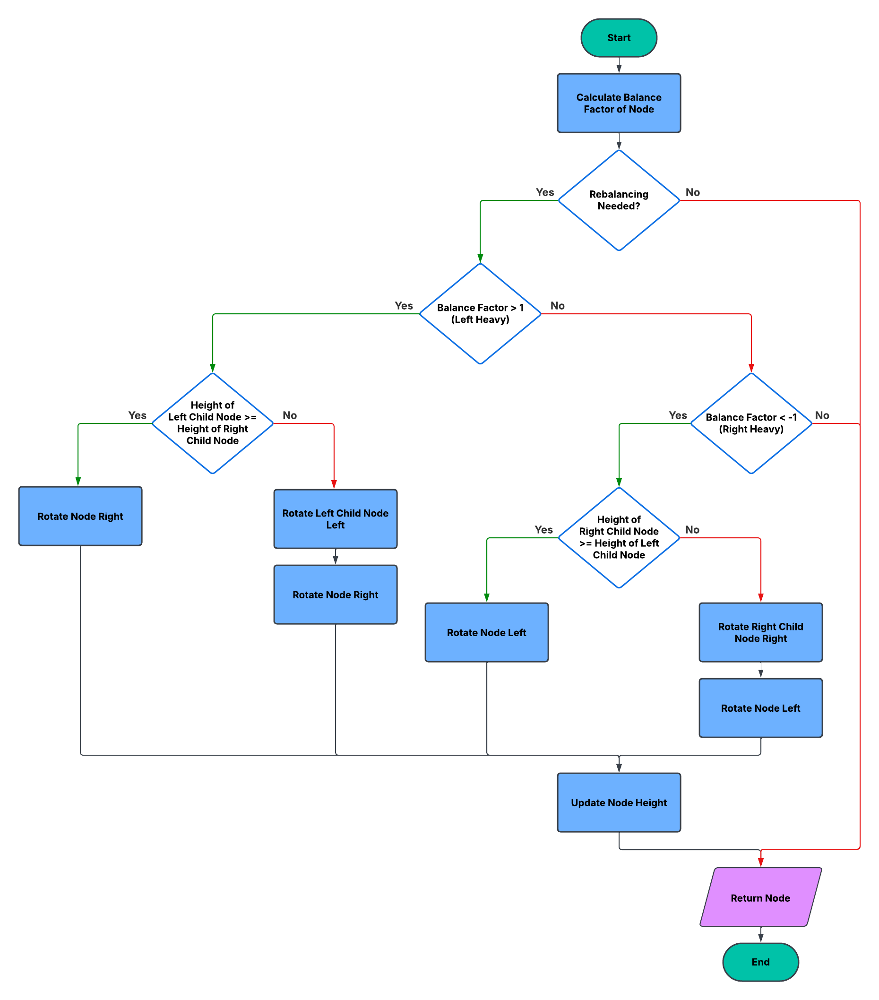

# CS499 | ePortfolio

## Introduction
My name is Caleb and I started pursing a degree in Computer Science with a concentration in Software Engineering in October of 2022. With a full-time job and five young children, time management has become one of the most essential skills I've had to utilize and master throughout this program. Balancing work, family, and my academic responsibilities has pushed me to be deliberate and organized in my approach to learning. 

---
## Professional Self Assessment
[Insert Text]

---
## Portfolio Summary
[Insert Text]

---
## Course Outcomes
1. Employ strategies for building collaborative environments that enable diverse audiences to support organizational decision-making in the field of computer science.

2. Design, develop, and deliver professional-quality oral, written, and visual communications that are coherent, technically sound, and appropriately adapted to specific audiences and contexts.

3. Design and evaluate computing solutions that solve a given problem using algorithmic principles and computer science practices and standards appropriate to its solution while managing the trade-offs involved in design choices.

4. Demonstrate an ability to use well-founded and innovative techniques, skills, and tools in computing practices for the purpose of implementing computer solutions that deliver value and accomplish industry-specific goals.

5. Develop a security mindset that anticipates adversarial exploits in software architecture and designs to expose potential vulnerabilities, mitigate design flaws, and ensure privacy and enhanced security of data and resources.

---
## Code Review Video

My code review for these artifacts focuses on existing functionality, code analysis, and planned enhancements. It begins by reviewing the original functionality, after which specific areas for improvement—such as logic, security, and documentation—are identified based on a course-provided code review checklist. Finally, it outlines my planned enhancements that address these issues, along with any additional improvements needed to ensure alignment with the course outcomes.



---
## Software Design & Engineering
### [Artifact 1: Smart Thermostat](https://github.com/calebmirwin/CS499/tree/main/Artifact%201){: .btn}

**Description:** The original artifact is a smart thermostat program developed in December 2024 as the final project for CS-350: Emerging Systems Architectures and Technologies. It was built using the CC3220S LaunchPad. The original program simulated smart thermostat functionality by using UART for server communication, I2C to read temperature data, onboard buttons to adjust the setpoint, and an LED to indicate heat activation.

**Enhancement:** This enhancement expanded the functionality of the original artifact by converting from NORTOS to TI-RTOS in order to support real-time scheduling and by replacing the UART interface with Wi-Fi-based two-way TCP socket communication, though UART was retained for debugging. The internet connectivity allowed for time synchronization with NTP servers to allow for implementation of daily setpoint scheduling. I also created a Python remote control application with a graphical user interface (GUI) to control the smart thermostat remotely.

  <a href="https://github.com/calebmirwin/CS499/blob/main/Artifact%201/Irwin_CS499_SoftwareDesignandEngineering.pdf" class="button" style="margin-right: 10px;">Narrative</a>
  <a href="https://github.com/calebmirwin/CS499/tree/main/Artifact%201/Original/Irwin_SmartThermostat" class="button" style="margin-right: 10px;">Original Artifact</a>
  <a href="https://github.com/calebmirwin/CS499/tree/main/Artifact%201/Enhancement/Irwin_EnhancedSmartThermostat" class="button">Enhanced Artifact</a>

---
## Algorithms & Data Structures
### [Artifact 2: ABCU Advising Program](https://github.com/calebmirwin/CS499/tree/main/Artifact%202){: .btn}

**Description:** [Insert Text]

**Enhancement:** [Insert Text]

### reblance() Method - Flowchart

  <a href="https://github.com/calebmirwin/CS499/blob/main/Artifact%202/Irwin_CS499_AlgorithmsAndDataStructures.pdf" class="button"  style="margin-right: 10px;">Narrative</a>
  <a href="https://github.com/calebmirwin/CS499/tree/main/Artifact%202/Original/Irwin_ABCUAdvisingProgram" class="button" style="margin-right: 10px;">Original Artifact</a>
  <a href="https://github.com/calebmirwin/CS499/tree/main/Artifact%202/Enhanced/Irwin_EnhancedABCUAdvisingProgram" class="button">Enhanced Artifact</a>

---
## Databases
### [Artifact 3: Investment App](https://github.com/calebmirwin/CS499/tree/main/Artifact%203){: .btn}

**Description:** [Insert Text]

**Enhancement:** [Insert Text]

  <a href="https://github.com/calebmirwin/CS499/blob/main/Artifact%203/Irwin_CS499_Databases.pdf" class="button" style="margin-right: 10px;">Narrative</a>
  <a href="https://github.com/calebmirwin/CS499/tree/main/Artifact%203/Original" class="button" style="margin-right: 10px;">Original Artifact</a>
  <a href="https://github.com/calebmirwin/CS499/tree/main/Artifact%203/Enhancement" class="button">Enhanced Artifact</a>

