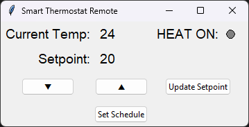
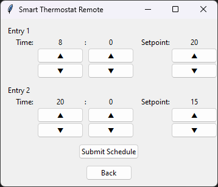
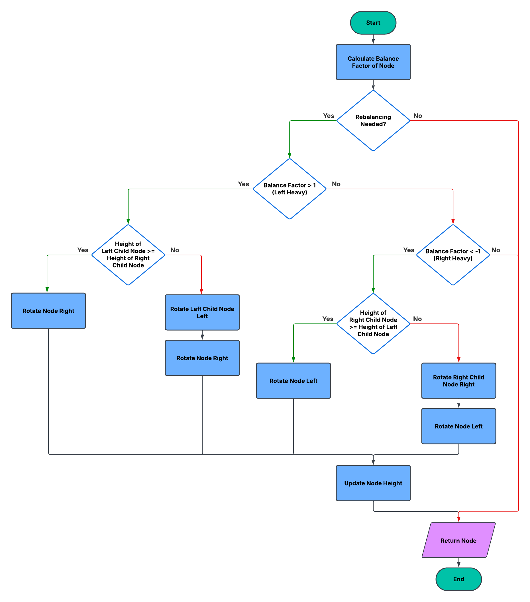

# CS499 | ePortfolio

## Introduction
My name is Caleb and I started pursing a degree in Computer Science with a concentration in Software Engineering in October of 2022. With a full-time job and five young children, time management has become one of the most essential skills I've had to utilize and master throughout this program. Balancing work, family, and my academic responsibilities has pushed me to be deliberate and organized in my approach to learning. 

---
## Professional Self Assessment
[Insert Text]

---
## Portfolio Summary
[Insert Text]

---
## Course Outcomes
1. Employ strategies for building collaborative environments that enable diverse audiences to support organizational decision-making in the field of computer science.

2. Design, develop, and deliver professional-quality oral, written, and visual communications that are coherent, technically sound, and appropriately adapted to specific audiences and contexts.

3. Design and evaluate computing solutions that solve a given problem using algorithmic principles and computer science practices and standards appropriate to its solution while managing the trade-offs involved in design choices.

4. Demonstrate an ability to use well-founded and innovative techniques, skills, and tools in computing practices for the purpose of implementing computer solutions that deliver value and accomplish industry-specific goals.

5. Develop a security mindset that anticipates adversarial exploits in software architecture and designs to expose potential vulnerabilities, mitigate design flaws, and ensure privacy and enhanced security of data and resources.

---
## Code Review Video

My code review for these artifacts focuses on existing functionality, code analysis, and planned enhancements. It begins by reviewing the original functionality, after which specific areas for improvement—such as logic, security, and documentation—are identified based on a course-provided code review checklist. Finally, it outlines my planned enhancements that address these issues, along with any additional improvements needed to ensure alignment with the course outcomes.



---
## Software Design & Engineering
### [Artifact 1: Smart Thermostat](https://github.com/calebmirwin/CS499/tree/main/Artifact%201){: .btn}

**Description:** The original artifact is a smart thermostat program developed in December 2024 for CS-350: *Emerging Systems Architectures and Technologies*. It was built using the CC3220S LaunchPad. The original program simulated smart thermostat functionality by using UART for server communication, I2C to read temperature data, onboard buttons to adjust the setpoint, and an LED to indicate heat activation.

**Enhancement:** This enhancement expanded the functionality of the original artifact by converting from NORTOS to TI-RTOS in order to support real-time scheduling and by replacing the UART interface with Wi-Fi-based two-way TCP socket communication, though UART was retained for debugging. The internet connectivity allowed for time synchronization with NTP servers to allow for implementation of daily setpoint scheduling. I also created a Python remote control application with a graphical user interface (GUI) to control the smart thermostat remotely.

#### Python Remote Control - Main Screen

#### Python Remote Control - Schedule Screen

  <a href="https://github.com/calebmirwin/CS499/blob/main/Artifact%201/Irwin_CS499_SoftwareDesignandEngineering.pdf" class="button">Full Narrative</a>
  <a href="https://github.com/calebmirwin/CS499/tree/main/Artifact%201/Original/Irwin_SmartThermostat" class="button">Original Artifact</a>
  <a href="https://github.com/calebmirwin/CS499/tree/main/Artifact%201/Enhancement/Irwin_EnhancedSmartThermostat" class="button">Enhanced Artifact</a>

---
## Algorithms & Data Structures
### [Artifact 2: ABCU Advising Program](https://github.com/calebmirwin/CS499/tree/main/Artifact%202){: .btn}

**Description:** The original artifact is an advising program from CS300: *Data Structures and Algorithms: Analysis and Design*, developed in February 2024. The program required that it import a list of courses from a CSV file, and have the functionality to display all courses in order or search for a specific course. I was required to construct the program using an array, hash table, or binary search tree (BST). Due to the need to frequently search and display courses in alphabetical order, I chose to implement a BST. The dataset provided for this project resulted in a balanced tree.

**Enhancement:** Although the original dataset resulted in a balanced tree, this is unlikely in a real-world scenario and any insertions or deletions could quickly result in an unbalanced tree. This enhancement improved the performance and reliability of the original advising program by refactoring its underlying data structure from a standard BST to an AVL tree, a self-balancing variant that ensures efficient operations even in worst-case scenarios. To implement this, I developed a `rebalance()` method and supporting helper methods such as `leftRotate()`, `rightRotate()`, `height()`, and `updateHeight()` to maintain tree balance dynamically after insertions and deletions. A flowchart outlining the logic of the `rebalance()` method is depicted below. I also transitioned the program to use smart pointers to improve memory safety and reduce the risk of leaks or dangling references, as well as incorporated structured exception handling to replace basic output error messages with more robust error management.

#### reblance() Method - Flowchart

  <a href="https://github.com/calebmirwin/CS499/blob/main/Artifact%202/Irwin_CS499_AlgorithmsAndDataStructures.pdf" class="button">Full Narrative</a>
  <a href="https://github.com/calebmirwin/CS499/tree/main/Artifact%202/Original/Irwin_ABCUAdvisingProgram" class="button">Original Artifact</a>
  <a href="https://github.com/calebmirwin/CS499/tree/main/Artifact%202/Enhanced/Irwin_EnhancedABCUAdvisingProgram" class="button">Enhanced Artifact</a>

---
## Databases
### [Artifact 3: Investment App](https://github.com/calebmirwin/CS499/tree/main/Artifact%203){: .btn}

**Description:** The original artifact is an investment application from CS410: *Software Reverse Engineering*, developed in February 2025. The program required that I reverse-engineer a compiled binary back into C++ source code and then identify and address its security vulnerabilities. One of the biggest issues with the original program was its heavy use of hardcoded data. This is not only a security concern, but also limits the programs maintainability and scalability. The program lacked any form of persistent storage or user authentication, and it stored plaintext client information and passwords directly in the source code.

**Enhancement:** This enhancement improved the original application by replacing hardcoded data with a secure and scalable database. The program was refactored from C++ to Python in order to simplify integration with MongoDB and bcrypt. The updated design implements hashed and salted passwords and role-based access controls (RBAC) to ensure that only authorized users can access or modify sensitive information. A dynamic menu system was used to adjust the menu options based on the logged in user's roles. 

  <a href="https://github.com/calebmirwin/CS499/blob/main/Artifact%203/Irwin_CS499_Databases.pdf" class="button">Full Narrative</a>
  <a href="https://github.com/calebmirwin/CS499/tree/main/Artifact%203/Original" class="button">Original Artifact</a>
  <a href="https://github.com/calebmirwin/CS499/tree/main/Artifact%203/Enhancement" class="button">Enhanced Artifact</a>

